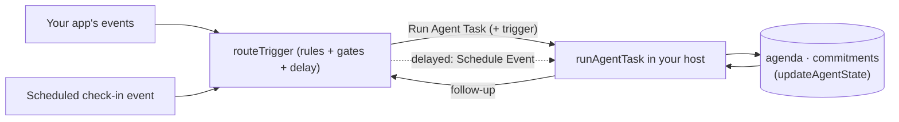

# @readysetcloud/agent

Portable, framework-agnostic Node agent core for Ready, Set, Cloud: a
[Strands-TS](https://github.com/strands-agents) assistant with DynamoDB-backed
conversation snapshots and pluggable cross-session memory.

The package knows nothing about WebSockets, AgentCore, HTTP, or any app. It
produces a configured Strands `Agent`, runs a turn through a wire-protocol
streamer, and persists conversation snapshots for multi-turn continuity. Cross-
session memory is transport-specific, so the host supplies a Strands
`memoryManager` (in rsc-core, the runtime backs it with AgentCore Memory). A host
(an AgentCore Runtime artifact, a Lambda, a test) supplies the transport,
identity, and memory backend.

## Install

```bash
npm install @readysetcloud/agent
```

Requires Node 22+. All dependencies are pure-JS AWS SDK v3 clients plus the
Strands SDK and `zod`.

## API — `import { ... } from '@readysetcloud/agent'`

| Export | Purpose |
| --- | --- |
| `createAssistant({ sessionId, modelId?, systemPrompt?, temperature?, maxTokens?, tools?, memoryManager?, storage? })` | Builds a Strands `Agent` with a DynamoDB session manager (snapshots) and, when a `memoryManager` is passed, cross-session memory (recall + auto-injection + extraction). |
| `handleUserMessage(agent, { request, sessionId, send })` | Runs one turn: streams wire messages via `send`, flushes the memory manager so the turn is durably captured, returns the assistant text. |
| `createSession({ userId, systemPrompt?, modelId?, temperature?, maxTokens?, title?, tools?, mcpServers?, sessionId?, tableName? })`, `getSessionConfig(sessionId, tableName?)` | Per-session config so a generic host loads prompt/model/tools by `sessionId` at connect (no redeploy to change behavior). `createSession` sets the owner; the host enforces it. `tools` selects first-party tools by name; `mcpServers` attaches external MCP tool sources (see [MCP servers](#mcp-servers-external-tools)). Also on the `./memory` subpath. |
| `runAgentTask({ taskId, principal, request, buildAgent, … })` | Runs one autonomous (non-chat) task to completion in the host: warm-cache → idempotent claim → `buildAgent` → run → record row → emit result event. See [Autonomous tasks](#autonomous-tasks-non-chat-agents). |
| `handleTask(agent, { request })` | Buffered sibling of `handleUserMessage`: invokes the agent, flushes memory, returns the final text — no streaming. The single-turn primitive `runAgentTask` wraps. |
| `runAgent({ input, systemPrompt?, modelId?, tools?, outputSchema?, maxIterations?, invocationState?, … })` | Stateless one-shot server-side invocation — build-and-discard, no session/snapshot/table. Enforces a Zod `outputSchema` (returns the validated object), bounds tool loops with `maxIterations`, and injects trusted per-call context via `invocationState`. See [Server-side one-shot runs](#server-side-one-shot-runs-runagent). |
| `tool({ name, description, inputSchema, callback })` | Re-export of the Strands tool-definition helper, so hosts define tools without importing the SDK directly. Handlers read trusted context from `context.invocationState`. |
| `builtinTools`, `BUILTIN_TOOL_NAMES`, `httpRequest`, `notebook` | Shipped first-party tools. `builtinTools` is a ready-made registry (`http_request`, `notebook`) a host spreads into its own; the raw instances attach directly to a `tools` list. `http_request` is the web-search / external-API seam. See [Built-in tools](#built-in-tools). |
| `createTask` / `startTask` / `finishTask` / `getTask`, `requestAgentTask` / `emitTaskCompleted`, `TaskResultCache` | The autonomous-task data plane: durable task rows (idempotent lifecycle), the EventBridge trigger/result contract, and an in-memory result cache. All Strands-free (on `./memory`). |
| `streamTurn(stream, { sessionId, send })`, `toStreamEventBodies(event)` | Streaming primitives / the SDK→wire normalizer (the one SDK coupling point). |
| `DynamoSnapshotStorage` | Implements Strands' `SnapshotStorage` port against the single table. |
| `DEFAULT_MODEL_ID`, `DEFAULT_REGION`, `DEFAULT_SYSTEM_PROMPT`, `DEFAULT_MAX_TOKENS`, `DEFAULT_TEMPERATURE` | Config constants (env-overridable). |
| wire types — `ServerMessage`, `ClientMessage`, `AgentStreamEventBody`, `SendMessage` | The streaming contract shared with the UI client. |
| `@readysetcloud/agent/agency` — `definePersistentAgent`, plus the primitives under it: `routeTrigger`, `reconcileAgenda`, `openCommitment` / `advanceCommitment`, `checkInMoment`, `responseDelay`, `readAgentState` / `updateAgentState` | The **persistent agent** type, a build tool you run in your own stack: define an agent type once and get its router and task handler, with trigger rules, human-like pacing, durable agendas and commitments, and scheduled check-ins. Strands-free. See [Persistent agents](#persistent-agents--a-build-tool-readysetcloudagentagency). |

Cross-session memory is **not** built into `createAssistant`. Pass a Strands
`memoryManager` — the host owns the backend. In rsc-core the AgentCore Runtime
builds it from AgentCore Memory (`bedrock-agentcore/experimental/memory/strands`);
see `agent-runtime/src/index.ts`. This keeps the package transport-agnostic.

### `@readysetcloud/agent/memory` subpath

```ts
import { DynamoSnapshotStorage, createSession } from '@readysetcloud/agent/memory';
```

Re-exports only the modules that pull in **no** Strands SDK (snapshot storage +
session config) — import it from Lambdas so they don't bundle the agent runtime.
Importing the package root would transitively load Strands and its optional
integrations.

`@readysetcloud/agent/agency` is likewise Strands-free: the trigger router,
agendas, commitments, check-ins, and the agent state store (see
[Agency](#persistent-agents--a-build-tool-readysetcloudagentagency)).

## Agent types

The package builds four kinds of agent. The first three run on the shared
rsc-core service (or any host you point them at). The fourth is a **build
tool**: you define the agent type and run it in your own stack; the shared
service never hosts it.

| | Chat | Task | One-shot | Persistent agent |
| --- | --- | --- | --- | --- |
| **What it is** | A conversation streamed to a browser | One "do something" run, then report back | One stateless call that returns a typed answer | A long-lived agent with a job: woken by events, pursuing goals, keeping promises |
| **Started by** | A person opening a socket | An API call or a `Run Agent Task` event | Your code calling `runAgent` | Your trigger rules and its own scheduled check-ins |
| **Identity** | The verified user | A user or an allowlisted system | Whatever your code passes | Its own: `{ type: 'system', id: '<type>/<agentId>' }`, with a persona |
| **Lives** | One session (snapshots for ~30 days) | One run | One call | Indefinitely: state carries across every run |
| **Keeps** | Conversation snapshots, per-user memory | A task row with the result | Nothing | An agenda, commitments, cooldowns |
| **Paces itself** | No (answers when asked) | No | No | Yes: cooldowns and human-like delays |
| **Runs on** | Shared runtime | Shared task Lambda | Anywhere | **Your stack**: your router and task Lambdas |
| **Entry point** | `createAssistant`, `handleUserMessage` | `requestAgentTask`, `runAgentTask` | `runAgent` | `definePersistentAgent` (`./agency`) |

## Usage

```ts
import { createAssistant, handleUserMessage } from '@readysetcloud/agent';

// Once per session/connection. Pass a memoryManager (built by the host from the
// verified user) to enable cross-session memory; omit it for a stateless one.
const agent = createAssistant({ sessionId, memoryManager });

// Per turn — `send` pushes wire messages to the client (e.g. over a WebSocket):
const answer = await handleUserMessage(agent, {
  request: userText,
  sessionId,
  send: (msg) => socket.send(JSON.stringify(msg)),
});
```

**Identity is the verified caller.** The host builds the `memoryManager` scoped
to a trusted user id (e.g. a Cognito `sub` from a verified inbound JWT), never a
client-supplied value — so memory can't leak across users.

## Sessions (dynamic config)

A **session** carries its own configuration, so a single deployed host can serve
many differently-behaved agents without a redeploy — changing prompts or models
is a data operation.

```ts
import { createSession, getSessionConfig } from '@readysetcloud/agent';

// Create once (backend, or via an API that passes the verified userId):
const { sessionId } = await createSession({
  userId,                     // verified caller — becomes the session OWNER
  systemPrompt: 'You are a terse code reviewer.',
  modelId: 'us.anthropic.claude-sonnet-4-...',
  // temperature?, maxTokens?, title? — all optional; unset → package defaults
});

// The host loads it by id at connect and enforces ownership:
const config = await getSessionConfig(sessionId);
const agent = createAssistant({
  sessionId,
  userId,
  systemPrompt: config?.systemPrompt,
  modelId: config?.modelId,
  temperature: config?.temperature,
  maxTokens: config?.maxTokens,
});
```

The config row is `pk=SESSION#{sessionId}, sk=CONFIG` (same partition as that
session's snapshots) with `entity="SessionConfig"` and a TTL. **Safety:**
`createSession` records the owner `userId`; the host must compare
`config.userId` against the *verified* connecting user and refuse a mismatch, so
a leaked or guessed `sessionId` can't be used to resume another user's
conversation. A session with no config row → package defaults. `createSession`
is conditional on the session not already existing, so an owner can't be
overwritten. The generated `sessionId` is a UUID (satisfies AgentCore's runtime
session-id length requirement).

## Autonomous tasks (non-chat agents)

Beyond the streaming chat surface, the package runs **autonomous tasks**: a
one-shot "do something" invocation of the agent that goes through the same secure
runtime with no browser holding a socket. Chat needs a socket; a task needs a
**trigger**, an **identity**, and a **result sink** — those are the three pieces
here.

**One envelope.** The same `AgentTaskResult` shape — `{ taskId, status, output?,
error? }` — is what an API returns, what the task row stores, and what the result
event carries. `status` is `PENDING | RUNNING | COMPLETED | FAILED`.

**Identity is a `Principal`** — `{ type: 'user' | 'system', id }`. A `user` task
(id = verified Cognito `sub`) reuses session ownership and MCP `authHeader`
propagation unchanged. A `system` task (id = a service, e.g. `booked`) is for
ecosystem work with no owning user. Asserting a `system` principal is privileged — over the
account-internal event bus a first-party emitter is already trusted to assert it;
over a public host API it must be gated (see [Gating a system
principal](#gating-a-system-principal-a-host-responsibility)). When a human
launches a system task, the host records their id as `createdBy` (distinct from
`principal`) so they can still read it back even though the run acts as the
system.

### Triggering — event (decoupled) or a host API (sync-capable)

`requestAgentTask` emits a `"Run Agent Task"` event and returns the `taskId`
immediately — the fire-and-forget path, mirroring `requestSession`. A first-party
backend needs only `events:PutEvents`:

```ts
import { requestAgentTask } from '@readysetcloud/agent/memory';

const { taskId } = await requestAgentTask({
  principal: { type: 'system', id: 'booked' },   // or { type: 'user', id: sub }
  request: 'Summarize this week’s new blog comments',
  // optional: sessionId, systemPrompt/modelId/…, tools, mcpServers
});
```

A host can also expose a synchronous API (in rsc-core, `POST /agent/tasks` with a
`wait` flag) that triggers the run and waits briefly for the result, falling back
to the event when the run outlives the request timeout. See the [rsc-core
README](../README.md#agent-service--streaming-ai-chat).

### Running — `runAgentTask` (the host runs the agent)

The task **runs wherever the host runs it** — the portable core has no runtime of
its own. In rsc-core that's a Lambda consuming the `"Run Agent Task"` event; it
could equally be any compute with the package installed. `runAgentTask` owns the
whole lifecycle; you supply a `buildAgent` factory (called only *after* the claim
succeeds, so a duplicate never builds or connects anything):

```ts
import { runAgentTask, createAssistant, getSessionConfig, TaskResultCache } from '@readysetcloud/agent';

const cache = new TaskResultCache();   // module scope — reused across warm invocations

const result = await runAgentTask({
  taskId, principal, request, sessionId,
  cache,
  buildAgent: async () => {
    const config = sessionId ? await getSessionConfig(sessionId) : null;
    if (config && config.userId !== principal.id) throw new Error('not your session');
    const agent = createAssistant({ sessionId: sessionId ?? `task-${taskId}`, /* prompt/model/tools/mcp */ });
    return { agent, cleanup: async () => {/* disconnect MCP clients */} };
  },
});
```

`runAgentTask` = warm-cache check → **exclusive claim** → `buildAgent` →
`handleTask` → `finishTask` → `emitTaskCompleted`, returning the result envelope.
The claim (`startTask`) is a conditional write (only from absent/PENDING/FAILED),
so DynamoDB serializes N duplicate deliveries and exactly one wins — the
correctness guard against re-running the agent or its tools. The in-memory
`TaskResultCache` is only a warm-instance fast path in front of it (a miss is
always correct — never "task not found"). The lower-level primitives
(`startTask` / `finishTask` / `handleTask` / `emitTaskCompleted`) are exported too
if you need to compose the lifecycle yourself.

> **Memory:** `runAgentTask` runs whatever agent `buildAgent` returns. Pass a
> `memoryManager` to `createAssistant` for cross-session recall, or omit it for a
> stateless run — the host's choice. rsc-core's task Lambda runs memory-light
> (snapshots only) to avoid pulling the AgentCore Memory dependency into the
> function; the chat runtime is the one that wires full cross-session memory.

### Result — event + row (never a cross-boundary table read)

The host emits `"Agent Task Completed"` on **every** finished run, so async
consumers are uniform regardless of whether a synchronous caller was still
waiting. The task row is the host's own bookkeeping and the target of a
`GET /agent/tasks/{id}`; a result crosses a stack boundary as the **event**, not
a table read.

### Gating a system principal — a host responsibility

Like the MCP `mcpServers` allowlist, **who may assert a `system` principal is a
host decision, not the package's** — `requestAgentTask`/`createTask` take a
principal at face value, because their trusted callers (a first-party backend on
the account-internal bus) are already entitled to one. The gate matters only when
a host exposes task creation to a *public* caller.

In rsc-core, [`functions/create-task.mjs`](../functions/create-task.mjs) does
this for `POST /agent/tasks`: a request may include `system: '<id>'`, and the
Lambda mints a `system` principal only if the verified caller is allowlisted for
that id in `SYSTEM_TASK_PRINCIPALS` (comma-separated `sub:systemId` grants; a
`sub:*` grant allows any id; empty rejects all — opt in explicitly). The human
launcher is recorded as `createdBy` so they can still `GET` the task. A public
caller with no grant only ever gets a `user` task scoped to themselves. Add a
grant before a public caller can run as a system.

### `tableName` — library mode

Every data-plane call (`createTask`/`getTask`/…, `createSession`/
`getSessionConfig`, `new DynamoSnapshotStorage(tableName)`, and `createAssistant({
tableName })`) takes an optional `tableName`, defaulting to the `TABLE_NAME` env.
Pass it to run the agent in **your own** stack against **your own** table
(library mode) instead of through a shared host. Note the boundary: a library-mode
run does not go through the shared runtime's guarantees (Bedrock grant, MCP
allowlist, memory isolation) — your stack owns them.

## Persistent agents — a build tool (`@readysetcloud/agent/agency`)

```ts
import { definePersistentAgent } from '@readysetcloud/agent/agency';
```

> **Not a hosted service.** A persistent agent is the fourth [agent
> type](#agent-types) and the only one rsc-core does not run for you. You define
> the agent type in your app and deploy its router and task handler in your own
> stack, against your own table. Its events carry their own source
> (`agency.<name>`), so the shared task Lambda never picks them up.

A task that runs when asked is a function. An agent that feels like it has
**agency** is woken by things that concern it, paces itself like a person
would, keeps pursuing a goal until it is really done, remembers what it
promised, and shows up on its own now and then. The `./agency` subpath is the
set of primitives behind that, extracted from the AI managers in
[ai-fantasy-league](https://github.com/allenheltondev/ai-fantasy-league) and
made generic. It is **Strands-free** (a Lambda can import it without bundling
the runtime) and every piece composes with the task path above: a trigger
becomes a `"Run Agent Task"` request, and the task reads its agenda and
commitments on the way in and reconciles them on the way out.

| Piece | What it gives an agent |
| --- | --- |
| **Triggers** — `routeTrigger`, `TriggerRule`, `dynamoTriggerGates`, `eventBridgeDispatcher`, `humanDelay` | Reasons to act. A rule per event type says which agents an event concerns and what kind of task it calls for; atomic gates keep it from being woken twice for the same work (a per-agent cooldown, a once-per key, a shared cooldown); `urgent` bypasses them for deadlines. |
| **Response delays** — `responseDelay`, `RESPONSE_DELAY_PROFILES`, `ResponseDelayLever` | Timing that feels human. A seeded, right-skewed wait sized by the kind of event and the agent's own temperament, clamped so it never misses a deadline, identical on a redelivery. |
| **Agenda** — `reconcileAgenda`, `agendaLines`, `agendaPriority` | Goals that persist. Typed goals reconciled from what the host *observes*, never from what a model *says*; a need creates a goal once, the goal survives runs until an observation no longer reports it, stale reads cannot revive it. |
| **Commitments** — `openCommitment`, `advanceCommitment`, `dueCommitments` | Promises that are kept. "I'll look into that" becomes a record with an explicit lifecycle, owned by one task at a time, decided by results rather than words, with bounded reconsideration when the facts change. |
| **Check-ins** — `checkInMoment`, `nextCheckIn` | Initiative. A scheduled heartbeat (a few times a day, in the agent's time zone) that makes it review its agenda and open commitments unprompted, where "nothing to do" is a fine, model-free answer. |
| **State store** — `readAgentState`, `updateAgentState` | Durability. A revision-checked DynamoDB document per agent (and optional scope: a tenure, a season), so concurrent runs serialize instead of clobbering each other. |
| `seededRandom`, `seededRoll`, `hashString` | Replayable dice, so a redelivered event never changes an agent's mind. |

### Define one: `definePersistentAgent`

One definition per agent type. It names the type, says how to look up an
instance's persona and pacing, lists what wakes it and what it does for each
kind of task, and says how to observe what it still needs. You get back two
handlers to deploy and a check-in emitter.

```ts
// reviewer.ts — a code-review agent type your app runs.
import { definePersistentAgent, humanDelay } from '@readysetcloud/agent/agency';
import { runAgent } from '@readysetcloud/agent';
import { z } from 'zod';

type Persona = { name: string; voice: string };
type Need = { repo: string; pr: number };
type Intent = { test: string };                    // what a promise is about

export const reviewer = definePersistentAgent<Persona, Need, Intent>({
  name: 'reviewer',
  tableName: process.env.TABLE_NAME,

  // Who an instance is, and how it paces itself. null: not one of ours.
  profile: async (agentId) => {
    const row = await loadReviewer(agentId);
    return row && { persona: row.persona, pacing: { cooldownMs: 15 * 60_000, responseDelay: row.responseDelay } };
  },

  // What wakes it.
  rules: {
    'Pull Request Opened': {
      kind: 'review',
      agents: ({ detail }) => detail.reviewers,
      delay: humanDelay('considered', { deadline: (d) => d.dueAt }),
      request: ({ detail }) => `Review pull request #${detail.pr} in ${detail.repo}.`,
      payload: ({ detail }) => ({ repo: detail.repo, pr: detail.pr }),
    },
  },
  checkIn: { agents: () => listReviewerIds() },        // 9:00, 14:00, 20:00 ET by default

  // What it does, by task kind.
  tasks: {
    review: async (ctx) => {
      const { output } = await runAgent({
        input: ctx.request,
        systemPrompt: [
          `You are ${ctx.persona.name}. ${ctx.persona.voice}`,
          'Your open goals, best first:',
          ...ctx.agendaLines((g) => `review ${g.data.repo}#${g.data.pr}`),
        ].join('\n'),
        tools: reviewTools(ctx.payload),
        outputSchema: z.object({ summary: z.string(), followUpTest: z.string().nullable() }),
      });
      if (output.followUpTest)                         // "I'll look into that flaky test"
        await ctx.promise({
          kind: 'investigate',
          counterpart: String(ctx.payload.author),
          source: { channel: `pr-${ctx.payload.pr}`, ref: String(ctx.payload.commentId), visibility: 'shared' },
          intent: { test: output.followUpTest },
          expiresAt: new Date(ctx.now.getTime() + 2 * 86_400_000).toISOString(),
          request: `Investigate ${output.followUpTest}.`,
        });
      return output.summary;
    },
    investigate: async (ctx) => {                       // owns the promise above
      const c = ctx.commitment!;
      await ctx.advanceCommitment(c.id, { type: 'start', taskId: ctx.taskId });
      const verdict = await investigate(c.intent.test);
      await ctx.advanceCommitment(c.id, verdict.fixed
        ? { type: 'waiting', taskId: ctx.taskId, externalRef: verdict.prUrl }
        : { type: 'closed', taskId: ctx.taskId, status: 'declined', reason: 'not_reproducible', reconsider: true });
      return verdict.summary;
    },
    check_in: async (ctx) => {
      const due = ctx.dueCommitments((c) => flakeSeenAgain(c.intent.test));
      for (const c of due.reconsider) await ctx.redispatch(c, 'reconsider', `Look at ${c.intent.test} again.`);
      for (const c of due.resume) await ctx.redispatch(c, 'resume', `Investigate ${c.intent.test}.`);
      return due.reconsider.length + due.resume.length ? 'followed up' : 'nothing to do';
    },
  },

  // After every task: what does it still need? The agenda is reconciled from
  // this read, never from the model's output.
  observe: async (ctx) => ({
    needs: (await openReviewRequests(ctx.agentId)).map((r) => ({ id: `review:${r.repo}#${r.pr}`, kind: 'review', data: r })),
  }),
});
```

**What the definition gives you**

| Member | Use |
| --- | --- |
| `route(event)` | Your router Lambda. Routes your app's events and this type's `Agent Check-In` through the rules, gates, and delays, and dispatches one `Run Agent Task` per agent. |
| `handleTask(detail)` | Your task Lambda. Validates the task belongs to this type and principal, claims it once, loads the agenda and commitments (expiring looks never taken), runs the kind's handler, then reconciles the agenda from `observe`. Records `COMPLETED` or `FAILED` and emits `Agent Task Completed`. |
| `emitCheckIn(now?)`, `checkInEvent(now?)` | Call from a cron at each slot. Only agents of this type answer it. |
| `source` | The EventBridge source of everything this type emits, `agency.<name>` by default. |

**What a task handler gets (`ctx`)**: `agentId`, `persona`, `kind`, `request`,
`payload`, `now`, `agenda`, `agendaLines(describe)`, `commitments`, the
`commitment` it owns (for a promise's follow-up), `promise(...)`,
`advanceCommitment(id, event)`, `followUp({ kind, key, request })`,
`dueCommitments(materialChange)`, and `redispatch(commitment, mode, request)`.
Follow-ups and promises dispatch through the same path with deterministic task
ids, so a retried task never sends one twice.

### Safety for agents nobody is watching

Three guards are on by default, and none of them needs infrastructure beyond
what you deploy.

| Guard | Option | What it does |
| --- | --- | --- |
| Retries | `isRetryable` (default `isRetryableError`) | A throttle, a timeout, a network reset, a 429 or 5xx, or state-write contention is rethrown with the claim given back, so your task Lambda's invocation fails and the platform delivers the task again. Anything else ends as `FAILED`. Pass `() => false` to never retry. |
| Pause | `paused()` | The kill switch. While it returns true, `route` dispatches nothing and `handleTask` drops what arrives, unclaimed. Back it with something you can flip without a deploy. Queued promises resume at the next check-in. |
| Task cap | `taskCap` (default 100 per agent per rolling day) | Bounds runaway loops of check-ins, follow-ups, and promises. Each task id counts once, so a retry or redelivery is free. A capped task ends as `FAILED` with the reason. `null` turns it off. |

A retried task runs its handler again, so make handlers safe to repeat: use
`ctx.taskId` as the idempotency key for anything with side effects.
Follow-ups and promises already are, because their task ids are deterministic.

### Deploy it in your stack

```ts
// router.ts — rule: source [your app, "agency.reviewer"], your event types + "Agent Check-In"
export const handler = (event) => reviewer.route(event);

// task.ts — rule: source "agency.reviewer", detail-type "Run Agent Task"
export const handler = (event) => reviewer.handleTask(event.detail);

// check-in.ts — schedule: cron(0 9,14,20 * * ? *) in America/New_York
export const handler = () => reviewer.emitCheckIn();
```

| Your stack needs | Why |
| --- | --- |
| A DynamoDB table with `pk`/`sk` and TTL on `expiresAt` | Task rows, agent state, and trigger gates (pass `tableName`). |
| `events:PutEvents` on the bus | Dispatching tasks, follow-ups, check-ins, and completions. |
| rsc-core's `Schedule Event` primitive in the same account, or your own `dispatch` | Delayed tasks are handed to it. Pass `responseDelays: false` (or a custom `dispatch`) to run without it. |
| A Bedrock grant, if your handlers call a model | The handlers are yours; so is the model access. |
| A retry policy and a dead-letter queue on the task rule | Retryable errors come back through EventBridge's retry; the queue keeps whatever finally gives up. |

For tests and local runs, pass `store: memoryAgentStore()`, `gates:
memoryTriggerGates()`, a `dispatch` that calls `handleTask` directly, and
`responseDelays: false`.

### Under the hood: the primitives

`definePersistentAgent` is assembled from these, all exported for anyone who
needs a different shape.

### How the pieces fit



1. **Route.** Your event consumer calls `routeTrigger` with your rules. For each
   agent a rule concerns it takes the agent's cooldown slot (a conditional
   write), computes a delay, and dispatches a `"Run Agent Task"` with a
   deterministic `taskId` (`taskIdFor(eventId, agentId, kind)`) and a `trigger`
   `{ kind, eventId, detailType, payload }`. A delayed task is handed to the
   `Schedule Event` primitive named by its task id, so a redelivered trigger
   neither moves nor doubles it. A redelivery passes its own gates again and
   lands on the same task id, where `runAgentTask`'s claim makes it a no-op.
2. **Run.** Your `"Run Agent Task"` consumer reads `detail.trigger.kind` to pick
   the task's behavior, loads the agenda (`readAgentState`), puts
   `agendaLines(...)` in the prompt, and runs. Deterministic code decides what
   the agent *may* do; the agenda only orders the options (`agendaPriority` is a
   preference, never a permission).
3. **Reconcile.** After acting, the task observes the real state again (a fresh
   authoritative read, not the model's summary) and `reconcileAgenda`s it under
   `updateAgentState`. A goal completes only when the observation stops
   reporting the need; a pending request is not a result.
4. **Commit.** When a conversation produces a promise, `openCommitment` records
   it (by reference, never the text) and the task dispatches a follow-up task
   that owns it. That task reports back through `advanceCommitment` (`waiting`
   with the external thing it produced, or `closed` with a reason and the facts
   it rested on), and a later check-in `dueCommitments` picks up lost or
   reconsiderable ones.
5. **Check in.** A scheduled rule (EventBridge cron → an event carrying
   `checkInMoment(now)`) routes a `check_in` task to every agent, `oncePer`
   `date-slot`, with a `routine` delay so each one wanders in at its own time.

### Using the primitives directly

The same reviewer, assembled by hand rather than with `definePersistentAgent`.

```ts
// rules.ts — what wakes a reviewer agent, and how it paces itself.
import {
  routeTrigger, humanDelay, dynamoTriggerGates, eventBridgeDispatcher,
  type TriggerRuleMap, type TriggerRouterDeps,
} from '@readysetcloud/agent/agency';

type PrOpened = { repo: string; pr: number; reviewers: string[]; dueAt: string };
type CheckIn = { date: string; slot: string; nextAt: string };

const rules: TriggerRuleMap = {
  'Pull Request Opened': {
    kind: 'review',
    agents: ({ detail }: { detail: PrOpened }) => detail.reviewers,
    // Mulls it over for a bit, but always starts well before the due time.
    delay: humanDelay<PrOpened>('considered', { deadline: (d) => d.dueAt }),
    request: ({ detail }) => `Review pull request #${detail.pr} in ${detail.repo}.`,
    payload: ({ detail }) => ({ repo: detail.repo, pr: detail.pr }),
  },
  'Review Deadline Near': {
    kind: 'review',
    urgent: true,                                    // through any cooldown, no delay
    agents: ({ detail }: { detail: PrOpened }) => detail.reviewers,
    request: ({ detail }) => `Finish your review of #${detail.pr} now.`,
  },
  'Reviewer Check-In': {
    kind: 'check_in',
    agents: async () => listReviewerAgents(),
    oncePer: (d: CheckIn) => `${d.date}-${d.slot}`,  // once per slot, however often it is delivered
    delay: humanDelay<CheckIn>('routine', { deadline: (d) => d.nextAt }),
    request: () => 'Look over your open reviews and anything you said you would do.',
  },
};

const deps: TriggerRouterDeps = {
  rules,
  gates: dynamoTriggerGates({ prefix: 'reviewers' }),
  pacing: async (agentId) => {
    const persona = await getPersona(agentId);
    if (!persona) return null;                                 // not one of ours: skipped
    return { cooldownMs: 15 * 60_000, responseDelay: persona.responseDelay };   // { multiplier, immediateChance }
  },
  principal: (agentId) => ({ type: 'system', id: agentId }),
  // Its own source, so rsc-core's shared task Lambda never runs these tasks.
  dispatch: eventBridgeDispatcher({ source: 'agency.reviewer', sessionId: (t) => `reviewer-${t.agentId}` }),
  responseDelays: process.env.RESPONSE_DELAYS !== 'off',
};

export const handler = (event) => routeTrigger(deps, event);
```

```ts
// run.ts — the "Run Agent Task" consumer, with an agenda and commitments.
import { runAgentTask, createAssistant, tool } from '@readysetcloud/agent';
import {
  readAgentState, updateAgentState, reconcileAgenda, agendaLines, emptyAgenda,
  openCommitment, advanceCommitment, dueCommitments, emptyCommitments, taskIdFor,
  type Agenda, type CommitmentBook,
} from '@readysetcloud/agent/agency';

type Need = { repo: string; pr: number; reason: 'requested' | 'stale' };

export const handler = async ({ detail }) => {
  const { taskId, principal, request, trigger } = detail;
  const agentId = principal.id;

  await runAgentTask({
    taskId, principal, request,
    buildAgent: async () => {
      const agenda = (await readAgentState<Agenda<Need>>({ agentId, name: 'agenda' }))?.value ?? emptyAgenda<Need>();
      const agent = createAssistant({
        sessionId: `reviewer-${agentId}`,
        systemPrompt: [
          persona(agentId),
          'Your open goals, best first. A review you have merely started does not complete one:',
          ...agendaLines(agenda, (g) => `Review ${g.data.repo}#${g.data.pr} (${g.data.reason})`),
        ].join('\n'),
        tools: trigger?.kind === 'check_in' ? readOnlyTools : reviewTools,
      });
      return { agent };
    },
  });

  // Observe, don't trust: reconcile the agenda from the real review state.
  const open = await listOpenReviewRequests(agentId);       // an authoritative read
  await updateAgentState<Agenda<Need>>({
    agentId, name: 'agenda',
    update: (current) => reconcileAgenda(current ?? emptyAgenda<Need>(), {
      at: new Date().toISOString(), taskId,
      needs: open.map((r) => ({ id: `review:${r.repo}#${r.pr}`, kind: 'review', data: r })),
    }),
  });
};

// Elsewhere: a chat reply promised "I'll take a look at that flaky test".
export async function promiseToLook(agentId: string, msg: { channel: string; id: string; from: string }, intent: { test: string }) {
  const followUpId = taskIdFor(`promise:${msg.id}`, agentId, 'investigate');
  let outcome: string | undefined;
  await updateAgentState<CommitmentBook<typeof intent>>({
    agentId, name: 'commitments',
    update: (book) => {
      const r = openCommitment(book ?? emptyCommitments(), {
        kind: 'investigate', at: new Date().toISOString(), taskId: followUpId,
        counterpart: msg.from, source: { channel: msg.channel, ref: msg.id, visibility: 'shared' },
        intent, expiresAt: new Date(Date.now() + 2 * 24 * 60 * 60_000).toISOString(),
      });
      outcome = r.outcome;
      return r.book;
    },
  });
  if (outcome === 'created') await dispatchFollowUp(followUpId, agentId);   // through the same dispatcher
  // 'existing' (a redelivery) and 'duplicate' dispatch nothing; 'limit' means say so instead of promising.
}
```

The follow-up task calls `advanceCommitment(book, id, { type: 'start', taskId })`
when it begins, then `{ type: 'closed', status: 'declined', reason, facts,
reconsider: true }` or `{ type: 'waiting', externalRef }` with what it produced,
always *before* it says anything about it. A check-in runs
`dueCommitments(book, now, materialChange)` and re-dispatches a lost look
(`resume`) or a decline whose facts changed (`reconsider`) with a `redispatch`
event, at most once.

### Boundaries and guarantees

- **Observed, not claimed.** The agenda and commitments change only through
  deterministic transitions fed by authoritative reads and task results. A
  model's summary never completes a goal or settles a promise.
- **Idempotent under at-least-once delivery.** Gates are owner-checked
  conditional writes; task ids are deterministic per (event, agent, kind);
  `openCommitment` is idempotent per source; `reconcileAgenda` rejects stale
  observations; `updateAgentState` is compare-and-swap. Redeliveries and
  replays converge.
- **Bounded.** Active goals, open commitments (per agent and per counterpart),
  history, child tasks per commitment, and reconsiderations are all capped
  (`AGENDA_LIMITS`, `COMMITMENT_LIMITS`; pass your own).
- **Private by construction.** A commitment stores where something was said,
  never the text; a follow-up re-reads it. Whether agenda lines reach a prompt
  that can write to a shared channel is your call (the fantasy league keeps
  them out of chat tasks).
- **Yours to run.** Persistent agents are never hosted by the shared service:
  their events use their own source, and `definePersistentAgent` refuses the
  shared `readysetcloud.agent` source.
- **Not included (yet).** The fantasy league also has a durable dispatch
  outbox with a recovery sweep and dollar-based budget admission. Both would
  need infrastructure in your stack. Here a dispatch that fails throws to the
  router (EventBridge retries it, and the gate stays the task's own so the retry
  passes), a failed task is retried the same way, and spend is bounded by the
  task cap. Dollar budgets, if you need them, belong in your handlers.

### Keys

- **Agent state:** `pk=AGENT#{agentId}`, `sk=STATE#{name}` or `STATE#{name}#{scope}` (`entity=AgentState`, `revision`, `value`). `definePersistentAgent` names its documents `<type>.agenda`, `<type>.commitments`, and `<type>.usage`.
- **Trigger gates:** `pk=TRIGGER#{[prefix#]slot}`, `sk=GATE` (`entity=TriggerGate`, `owner`, `lastTriggeredAt`, 30-day TTL).

## Server-side one-shot runs (`runAgent`)

`runAgent` is the bare primitive: build a Strands `Agent`, run **one** turn to
completion, return the answer. No session manager, no snapshots, no DynamoDB —
nothing persists, so it needs no table and leaves no trace. Where
`handleUserMessage` streams a chat turn to a browser and `runAgentTask` wraps a
run in a durable, idempotent task record, `runAgent` is what a **server-side
orchestrator** (e.g. a Lambda fanning one input across several independent
analyses) reaches for when each analysis is an isolated call.

```ts
import { runAgent } from '@readysetcloud/agent';
import { z } from 'zod';

// One-shot STRUCTURED analysis — no prose parsing, get a validated object.
const grammar = await runAgent({
  input: draft,
  modelId: 'us.anthropic.claude-lite-...',   // pin a model per lens
  systemPrompt: 'You are a grammar & spelling reviewer.',
  outputSchema: z.object({
    suggestions: z.array(z.object({ span: z.string(), fix: z.string() })),
  }),
});
grammar.output.suggestions;   // typed, schema-validated — not a string
```

- **Structured output enforcement.** Pass `outputSchema` (a Zod schema) and the
  SDK forces the model to emit against it; `output` is the validated object and
  `structured` is `true`. If the model can't produce a conforming result even
  after being forced, the SDK throws — a resolved call is a schema-valid one.
  Omit the schema and `output` is the response text.
- **Bounded tool loops.** Pass `tools` (first-party `tool()`s, an `McpClient`,
  or a sub-agent) for a tool-using analysis — a fact lens over web
  search/fetch — and cap the loop with `maxIterations` (mapped to the SDK's
  per-invocation `limits.turns`) so it can't run away.
- **Per-lens model selection.** `modelId` pins a Pro- vs Lite-tier model for
  this call; different lenses pick different models.
- **Trusted context injection.** `invocationState` is threaded to every tool's
  execution context (`context.invocationState`) and returned on the result. It
  is the injection point for values the model **must not supply or forge** — a
  `tenantId`, the caller's verified `sub`. Because it is not a tool input
  parameter, the model never sees or sets it; trusted code sets it, handlers
  read it:

  ```ts
  import { runAgent, tool } from '@readysetcloud/agent';
  import { z } from 'zod';

  const searchBlog = tool({
    name: 'search_blog',
    description: "Search the tenant's own posts",
    inputSchema: z.object({ query: z.string() }),   // model supplies only this
    callback: async ({ query }, context) => {
      const tenantId = context?.invocationState.tenantId as string;  // trusted, not model-supplied
      return searchWithinTenant(tenantId, query);
    },
  });

  const facts = await runAgent({
    input: draft,
    systemPrompt: 'Fact-check claims using the blog search tool.',
    tools: [searchBlog],
    maxIterations: 6,
    invocationState: { tenantId, sub },   // injected by trusted code
  });
  ```

**Multi-lens engine sketch.** Each lens is an independent `runAgent` call; the
orchestrator fans them out and (optionally) synthesizes:

```ts
const [grammar, llm, facts] = await Promise.all([
  runAgent({ input, systemPrompt: GRAMMAR, outputSchema: GrammarSchema }),
  runAgent({ input, systemPrompt: LLM_DETECT, outputSchema: DetectSchema }),
  runAgent({ input, systemPrompt: FACTS, tools: [searchBlog], maxIterations: 6,
             invocationState: { tenantId, sub } }),
]);

const summary = await runAgent({
  input: JSON.stringify({ grammar: grammar.output, llm: llm.output, facts: facts.output }),
  systemPrompt: SUMMARY,
  outputSchema: SummarySchema,
});
```

To attach an **MCP** web-search/fetch gateway to a lens instead of first-party
tools, connect it and pass the client in `tools` — see [MCP servers](#mcp-servers-external-tools)
for how the runtime resolves specs and forwards verified identity via
`authHeader`. For a **durable** orchestrator (idempotent under at-least-once
delivery), run the outer call as a task (`runAgentTask`) and let its lenses call
`runAgent`. Streaming a run's tokens is not covered here — `runAgent` buffers
the final answer.

## Built-in tools

The package ships a small set of generic, first-party tools so every consumer
gets common capabilities without re-authoring a wrapper. They're thin factories
over the Strands SDK's own **vended tools**, so the implementations stay
maintained and schema-validated upstream:

| Name | What it does |
| --- | --- |
| `http_request` | Generic HTTP client (GET/POST/…). The **web-search** seam: point it at a search API and let the model read the JSON back. Also any public REST endpoint or webhook, without a bespoke tool per integration. |
| `notebook` | An in-invocation scratchpad the model writes to and re-reads across steps of a run. State lives in the invocation, not on the host. |

`builtinTools` is a `ToolRegistry` a host spreads into its own so a session opts
in **by name**; the raw instances (`httpRequest`, `notebook`) attach directly to
any `tools` list:

```ts
import { createAssistant, runAgent, builtinTools, httpRequest, tool } from '@readysetcloud/agent';

// (a) Host registry: session enables it via `tools: ['http_request']` in its config.
const TOOL_REGISTRY = { ...builtinTools, get_current_time: () => tool({ /* … */ }) };

// (b) Direct attach — e.g. an agent in another repo that just needs web search:
const res = await runAgent({
  input: 'What shipped in the latest Strands TS release? Search the web.',
  systemPrompt: 'Use http_request against https://api.tavily.com/search (Bearer $TAVILY_KEY) to search, then answer.',
  tools: [httpRequest],
  maxIterations: 6,
});
```

**Web search, concretely.** There is no dedicated search tool in the SDK — the
model drives `http_request`: it forms the request to a search API (the key rides
in the URL/headers your prompt or host supplies) and reads the results back. This
keeps the package provider-neutral; swap Tavily/Brave/Exa/etc. by changing the
endpoint, no code change here.

**Not exposed: `bash`, `file_editor`.** The SDK also vends these; this package
deliberately omits them because it's meant to run in a shared, hosted runtime
where shell exec is remote code execution and filesystem access reaches the
host's disk. A host that wants them imports them from the SDK and registers them
itself — an explicit, auditable choice.

**`http_request` is an outbound-request (SSRF) surface** — the model chooses the
URL. In rsc-core the runtime has no ambient outbound credentials and its network
egress is the boundary; a host with tighter needs should front it with an
allowlist or prefer a scoped MCP web-search gateway (below).

## MCP servers (external tools)

Beyond first-party `tools`, a session can attach external
[MCP](https://modelcontextprotocol.io) servers — the one place a session points
the runtime at an outbound URL. Each entry in `mcpServers` is an `McpServerSpec`
(a JSON-serializable subset of the Strands SDK's `McpServerConfig`), keyed by a
label:

```ts
await createSession({
  userId,                              // verified caller — the session owner
  mcpServers: {
    blog: {
      url: 'https://mcp.example.com/mcp',
      headers: { 'x-api-version': '2025-01' },   // user-supplied; `${VAR}` interpolated by the host
    },
  },
});
```

The host connects these at build time (`McpClient.loadServers`) and attaches
their tools alongside the first-party ones. `${VAR}` / `${env:VAR}` in string
fields is resolved by the SDK against the **host's** environment, so any secret
belongs in the runtime env — not in this row (which the user creates).

### SSRF allowlist — a host responsibility

Because `mcpServers` is an outbound URL under user control, the **host** must
allowlist which hosts a session may target before persisting the config — this
package does not. In rsc-core, `functions/create-session.mjs` rejects any
`mcpServers` whose url host is not in `MCP_ALLOWED_HOSTS` (comma-separated;
empty rejects all, so it's opt-in), threaded from the `McpAllowedHosts`
CloudFormation parameter. Add a host there before a session can reference it.

### `authHeader` — propagating verified identity to an MCP server

The SDK's env interpolation only reaches the *host's* env; it can't carry the
**connecting user's** verified identity to an MCP server. That matters for a
per-tenant tool (e.g. a blog search that must scope results to the asking user):
the server needs to know (a) the caller is the trusted runtime and (b) *which*
user is asking — and the config row, created by the user, is not a trusted place
for a per-user secret.

`McpServerSpec.authHeader` closes that gap:

```ts
mcpServers: {
  blog: {
    url: 'https://mcp.example.com/mcp',
    authHeader: {
      name: 'x-booked-auth',
      value: '<base64url(payload)>.<sig>',   // authority-minted, opaque to the runtime
    },
  },
}
```

- An **authority** (a trusted server-side session creator, *not* the browser)
  mints the token: it signs the identity/scope it wants the server to trust —
  e.g. `HMAC_SHA256(secret, `${tenantId}.${userId}.${sessionId}.${version}`)` —
  with a secret only the authority and the MCP server hold, and stores
  `{ name, value }` on the spec.
- The **runtime is a dumb courier**: it forwards `value` verbatim as the named
  outbound header on every request to that server and never interprets it.
  `authHeader` is applied *after* the user-supplied `headers`, so a session's own
  `headers` can't shadow it, and — unlike `headers` — it is passed through
  **literally** (no `${}` interpolation); mint opaque tokens with no `${` in
  them.
- The **MCP server** verifies the token with the shared secret, then trusts the
  claimed tenant/user.

**Threat model (state it plainly):** the HMAC proves *"the authority minted this
for user U"* — it does **not** cryptographically prove the presenter is this
runtime. That's acceptable here because the config row isn't user-reachable, the
host is allowlisted (above), and transport is TLS. Because the token is replayed
on every reconnect over the session's ~30-day TTL it is effectively long-lived;
bind it to the `sessionId` (so a leak can't move to another session) and include
a `version` the authority can bump to revoke outstanding tokens without rotating
the secret. A non-expiring, `sessionId`-bound, `version`-revocable token is a
defensible posture for a tool that only reads the owner's own content — document
the lifetime rather than implying a short-lived token.

## Wire protocol

`send` receives `ServerMessage`s spoken to the browser, unchanged from the
original Python agent:

```
{ type: "stream_event", event: { data } | { current_tool_use: { name, tool_use_id } } | { init_event_loop: true } | { complete: true } }
{ type: "complete", session_id }
{ type: "error", error, message? }
```

## Environment

Read at module scope; the same code runs in AgentCore, a Lambda, or a test.

| Variable | Required | Default | Used by |
| --- | --- | --- | --- |
| `TABLE_NAME` | Yes | — | Snapshot storage + session config (DynamoDB). |
| `BEDROCK_MODEL_ID` | No | `us.amazon.nova-lite-v1:0` | Chat model. |
| `BEDROCK_REGION` / `AWS_REGION` | No | `us-east-1` | Bedrock region. |
| `BEDROCK_MAX_TOKENS` | No | `4096` | Model max tokens. |
| `BEDROCK_TEMPERATURE` | No | `0.7` | Model temperature. |

Cross-session memory has **no** env here — the host owns the backend. In
rsc-core the runtime reads `AGENT_MEMORY_ID` (the AgentCore Memory resource) to
build the `memoryManager`; see `agent-runtime`.

### Single-table keys

The agent core expects a single DynamoDB table with these keys (match them, or
adapt `DynamoSnapshotStorage`):

- **Snapshots:** `pk=SESSION#{sessionId}`, `sk=SNAPSHOT#{scope}#{scopeId}#{id}` / `LATEST#…` / `MANIFEST#…`.
- **Session config:** `pk=SESSION#{sessionId}`, `sk=CONFIG` (owner + prompt/model/tools).
- **Task records:** `pk=TASK#{taskId}`, `sk=STATUS` (autonomous-run status/result, short TTL).
- **Agent state:** `pk=AGENT#{agentId}`, `sk=STATE#{name}[#{scope}]` (agenda, commitments: revision-checked documents).
- **Trigger gates:** `pk=TRIGGER#{slot}`, `sk=GATE` (cooldowns and once-per keys, owner-checked).

Every data-plane function takes an optional `tableName` (defaulting to
`TABLE_NAME`) so the package can be pointed at any table — see [`tableName` —
library mode](#tablename--library-mode).

Cross-session semantic memory is **not** in this table — it lives in AgentCore
Memory (managed), written per turn via `createEvent` and retrieved by the
`memoryManager`.

## SDK contract guardrail

`src/stream.ts` is the single place coupled to `@strands-agents/sdk` (pinned
**exact** at `1.9.0`). `src/stream.contract.test.ts` constructs real SDK event
instances and type-binds fixtures via `satisfies`, so an SDK bump that changes
the event contract fails `npm test` (runtime) or `npm run typecheck`
(compile-time, includes test files). If it fails, fix `stream.ts`, then bump the
exact pin. Keep both the test and the typecheck step in CI.

## Develop

```bash
cd agent
npm install
npm test          # vitest — stream normalizer, contract, turns, snapshot storage
npm run typecheck # tsc over src + tests (guards the SDK contract)
npm run build     # tsc → dist/ (ESM + .d.ts), emits `.` and `./memory` entrypoints
```
